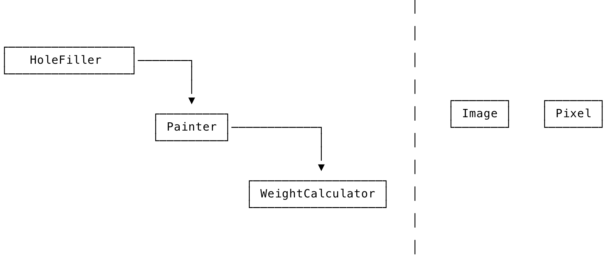
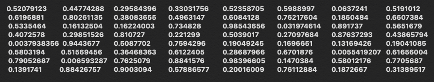
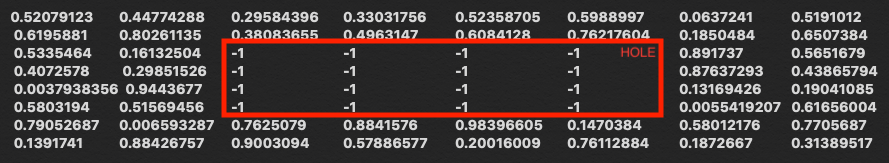
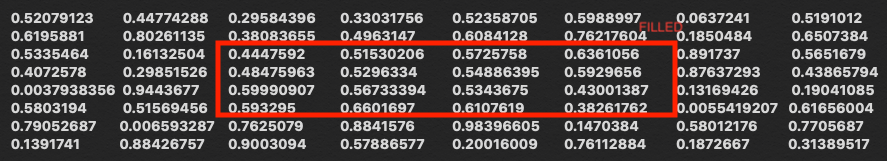

# Hole Filling 

The goal is to build a small image processing library that fills holes in images, along with a small command line utility that uses that library, and answer a few questions. T

The library must support filling holes in grayscale images, where each pixel value is a float in the range [0, 1] , and hole (missing) values which are marked with the value -1 . 

The library should provide the ability to fill a hole in an 

## Objects and dependencies


- `Image`
- `Pixel`
- `WeightCalculator`
- `Painter`
- `HoleFiller`


## Usage

### 1. Create a random image:
```swift
// Create objects and dependencies

let calculator = try! WeightCalculator()
let painter = Painter(calculator: calculator)
let filler = HoleFiller(painter: painter)

let image = createRandomImage(width: 8, height: 8)
```




### 2. Add holes to random image:

```swift
// Add holes to random image
let imageWithHoles = filler.addHoles(to: image)
```



### 3. Fill holes

```swift
// Fill holes 
let imageWithFilledHoles = filler.fillHoles(in: imageWithHoles)
```



